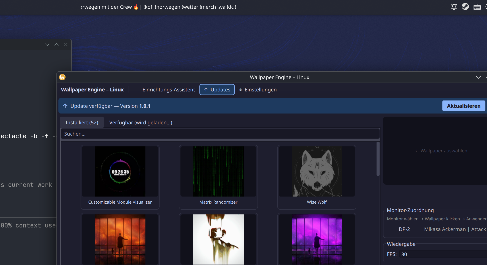

# Wallpaper Engine – Linux

A GUI frontend for [linux-wallpaperengine](https://github.com/Almamu/linux-wallpaperengine) — run Wallpaper Engine wallpapers on Linux. Built with Atomic desktops (Bazzite, Silverblue) in mind, but works on traditional distros too.



## Features

- **Browse & apply wallpapers** — installed (local) and subscribed-but-not-downloaded (via Steam API)
- **Multi-monitor** — assign a different wallpaper per monitor
- **Per-wallpaper configuration** — custom FPS, fullscreen pause, particle/mouse/audio overrides per wallpaper; multi-monitor configs are merged automatically
- **System tray** (`wallpaper-tray`) — lives in autostart, shows pause/resume controls, signals available updates
- **Fullscreen pause** — automatically pauses rendering when a fullscreen app is active (native engine flag, instant — no service restart)
- **Performance flags** — disable particles, mouse interaction, or audio processing globally or per wallpaper
- **Self-updater** — tray checks for updates on startup, GUI shows a banner; one click updates via `git reset --hard` + re-installs
- **LWE updater** — `git pull` + incremental rebuild with version and compatibility check
- **Service management** — start/stop/restart, autostart toggle, live log view
- **Setup wizard** — guided first-run, can build linux-wallpaperengine inside a Distrobox container
- **Atomic-first** — runs on immutable distros without system packages (Distrobox, Toolbox, or direct)

## Requirements

- [Wallpaper Engine](https://store.steampowered.com/app/431960/) on Steam (for assets and workshop wallpapers)
- [linux-wallpaperengine](https://github.com/Almamu/linux-wallpaperengine) binary (the setup wizard can build it for you)
- Python 3.11+
- PySide6 (`pip install --user PySide6` — `install.sh` handles this automatically)
- **Atomic desktops:** [Distrobox](https://distrobox.it/) (pre-installed on Bazzite)
- **Traditional distros:** build dependencies listed in Settings → Info

## Installation

```bash
git clone https://github.com/TKxRIZ/wallpaper-picker
cd wallpaper-picker
bash install.sh
```

`install.sh` will:
- Install the `wallpaper-picker` launcher to `~/.local/bin/`
- Download the `wallpaper-tray` binary from GitHub Releases
- Create a desktop entry and autostart entry (tray starts on login)
- Create a placeholder systemd user service

Then launch from the app menu or run `wallpaper-picker`.

On first start, the **Setup wizard** opens and guides you through:
1. Choosing an execution mode (Distrobox recommended on Atomic)
2. Locating or building the linux-wallpaperengine binary
3. Locating the Wallpaper Engine assets directory

## Components

| Component | Description |
|---|---|
| `wallpaper-picker` | Main GUI — browse, configure, apply wallpapers |
| `wallpaper-tray` | Background tray process — pause/resume, update checks, autostart |

The tray runs permanently in the background. The GUI is launched on demand.

## Usage

| Action | How |
|---|---|
| Apply wallpaper | Click a wallpaper → **Anwenden** |
| Multi-monitor | Click a monitor in the right panel → click a wallpaper |
| Change FPS | Right panel → Wiedergabe → FPS |
| Per-wallpaper settings | Click the **⚙** button on a wallpaper card |
| Pause/resume | Tray icon → **⏸ Pausieren** / **▶ Fortsetzen** |
| Check for updates | Toolbar → **↑ Updates** or wait for the tray to notify |
| Settings | Toolbar → **⚙ Einstellungen** |

## Settings

Settings are stored in `~/.config/wallpaper-picker/config.json`.

| Section | What's there |
|---|---|
| Engine | Execution mode, binary path, assets dir, performance flags |
| Service | Start/stop/restart, autostart, live log |
| Updates | Update URL, wallpaper-picker version check, linux-wallpaperengine status |
| Info | System info, setup guide for your distro |

## Per-Wallpaper Configuration

Click the **⚙** button on any installed wallpaper card to override global settings for that wallpaper:

- Custom FPS
- Fullscreen pause on/off
- Disable particles, mouse interaction, or audio processing

Configurations are stored in `~/.config/wallpaper-picker/wallpaper-configs/<id>.json`. On multi-monitor setups with different wallpapers per screen, configs are merged (lowest FPS wins, any enabled restriction applies).

## Execution modes

| Mode | When to use |
|---|---|
| `distrobox` | Bazzite, Silverblue, other immutable distros (recommended) |
| `direct` | Traditional distros with LWE installed to PATH |
| `toolbox` | Toolbx/Toolbox containers |
| `custom` | Any other prefix command |

## Updating

Updates are checked automatically by the tray on startup. When an update is available, the GUI shows a banner. Clicking **Aktualisieren** will:

1. `git fetch origin` + `git reset --hard origin/main`
2. Re-run `install.sh` to update the launcher, desktop files, and tray binary

The tray binary updates itself independently by downloading the new release binary from GitHub and re-executing.

## License

[LGPL-3.0](https://www.gnu.org/licenses/lgpl-3.0.html) — uses [PySide6](https://doc.qt.io/qtforpython/) (LGPL-3.0).

linux-wallpaperengine is [GPL-3.0](https://github.com/Almamu/linux-wallpaperengine/blob/master/LICENSE). Wallpaper Engine is proprietary software by Zlexy GmbH — you must own it on Steam.
